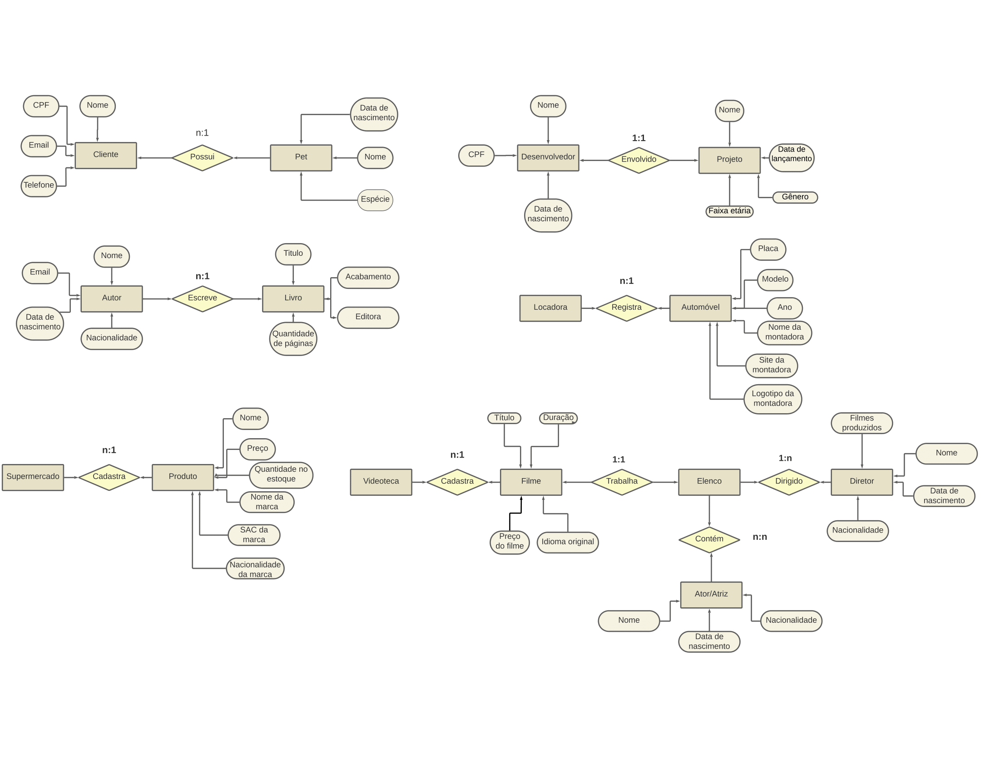
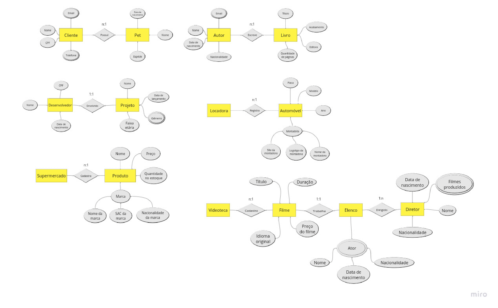
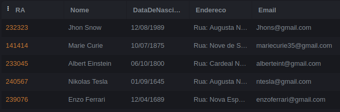

# Lista-de-exercicio-linguagem-sql
## Etapa 1

SLIDE 10 (NESTE EXERCÍCIO SERÁ OBSERVADO A IDENTIFICAÇÃO DOS ELEMENTOS DO DER (ENTIDADE/ATRIBUTOS/RELACIONAMENTO)

Crie um modelo de dados para os cenários a seguir:

1 - Um petshop deseja manter cadastrados seus clientes bem como seus pets.

Um cliente deve informar seu nome, CPF, e-mail e telefone, além do nome, espécie e data de nascimento de seu pet.

2 - Em uma produtora de games, há desenvolvedores, que possuem um nome, CPF, data de nascimento.

Cada projeto tem um nome, data de lançamento, gênero e faixa etária. Segundo o gerente de projetos, “cada desenvolvedor deve estar envolvido em um projeto”.

SLIDE 19 (NESTE EXERCÍCIO SERÁ OBSERVADO A CARDINALIDADE ENTRE OS COMPONENTES APRESENTADOS, ALÉM DA IDENTIFICAÇÃO DOS ELEMENTOS DO DER).

Uma biblioteca efetua registro de autores e livros. Um autor é cadastrado com seu nome, e-mail, nacionalidade e data de nascimento. Já um livro é registrado com o título, quantidade de páginas, acabamento e editora.

Uma locadora de automóveis, mantém registro dos automóveis. Um automóvel é cadastrado com placa, modelo, ano, nome da montadora, site da montadora, logotipo da montadora.

Um supermercado cadastra seus produtos. Um produto é identificado por seu nome, preço, quantidade em estoque, nome da marca, SAC da marca, nacionalidade da marca.

Uma videoteca precisa cadastrar o título, duração, idioma original e preço de cada filme. É necessário cadastrar também o elenco de cada filme onde se registra o nome, data de nascimento, nacionalidade de cada ator/atriz. Opcionalmente, inclua o cadastro de diretores com atributos que julgar necessários.

## Etapa 2

Conforme o material apresentado sobre atributos, refaça os MER criados para os exercícios acima, adaptando com os devidos atributos explicados durante a aula;

Utilize os exemplos citados durante a aula e o conteúdo disponibilizado no material;

Caso tenha dificuldades na utilização do LucindChat, está disponível o link da plataforma Miro, sendo similar a primeira opção dada durante as aulas.

## Etapa 3
Faça o exercício disponibilizado na aula do dia 04/09/2023 (slide 18);

Siga as seguintes instruções:

1 — Crie um banco de dados para armazenar dados de alunos. Um aluno deve ter RA, nome, data de nascimento, endereço e e-mail;

2 — Crie um banco de dados para armazenar dados de colaboradores de uma empresa. Um colaborador deve ter um código de identificação, nome, CPF, cargo e salário;

Insira pelo menos 5 registros em cada tabela;

Selecione os dados;
exercicio 1:

código: 
